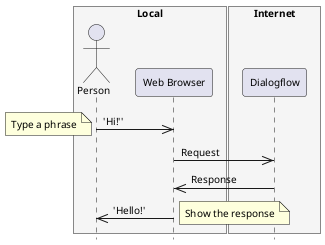
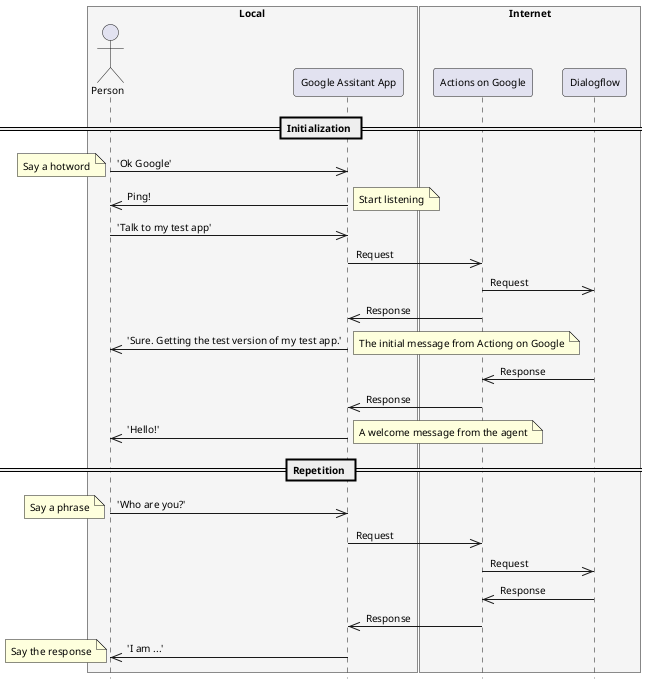
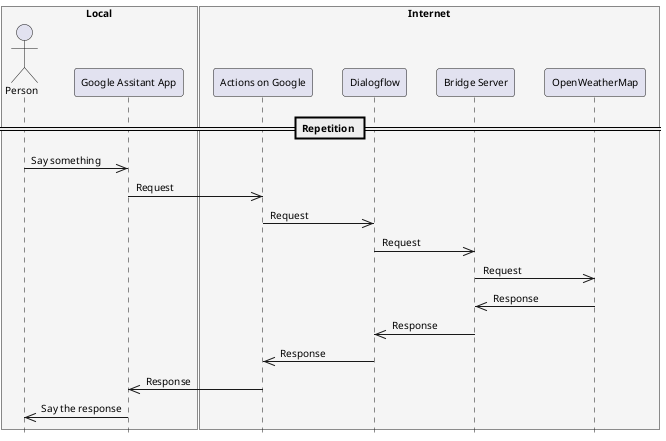
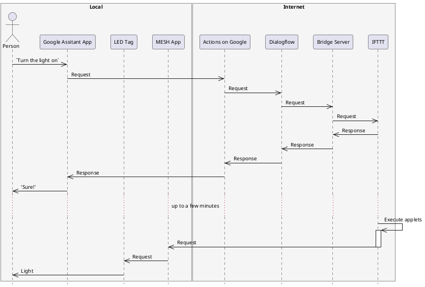

# Getting Started with Dialogflow

## What is Dialogflow?

* A service that enables you to build engaging voice and text-based conversational interfaces powered by AI.
* By providing examples of what a user might say when interacting, analyze and understand the user's intent.
* Can be easily combined with popular touchpoints such as Google Assistant, Slack, and Facebook Messenger.

## Basic concepts

* **Agents** are best described as NLU (Natural Language Understanding) modules. These can be included in your app, product, or service and transforms natural user requests into actionable data.
* **Intents** are the mechanisms that pick up what your user is requesting and direct the agent to respond accordingly.
* **Entities** are powerful tools used for extracting parameter values from natural language inputs.

## Let's Make Your First Agent

### The First Step

1. Point your web browser to https://dialogflow.com/
2. Press `SIGN UP FOR FREE`
3. Press `Google` under `Sign in with`, login with an account to be used for Dialogflow, allow dialogflow.com to 'View and manage your data across Google Cloud Platform services', and accept the `Terms of Service`
4. Now it's time to create your first agent! Press `CREATE AGENT` to go ahead and allow dialogflow.com to 'View and manage your Actions on Google'
5. Define the name of your first agent (e.g. Workshop) and press `SAVE`
6. Click on the icon in the top left to show the left navigation
7. Choose `Default Welcome Intent`
8. Give a few examples to `User says` (e.g. 'Hi', 'Hello', 'Howdy')
9. Press `SAVE` and wait for a while till `Agent training completed` appers on the bottom right of the console
10. Pick a phrase similar to what you gace to `User says`, type in the pharse to `Try it now` field on the upper right of the console and see what happnes

Congratulations! You were able to create the first (simple) agent. This agent works on the following system which consists of a local web browser and a web service on the Internet.



### Add Conversations for Small Talk

1. Click on `Small Talk` in the left navigation and click on `Enable` to enable small talk
2. Clink on `About agent` and pick a topic (e.g. `About agent`)
3. Give answers to questions
4. Press `SAVE` and try by typing pharses to `Try it now` field

### Your First Agent with Google Assitant

1. Click on `Integrations` in the left navigation
2. Clcik on `Google Assitant` and click on the toggle on the top right
3. Press `AUTHORIZE`, choose your account and allow dialogflow.com to 'View and manage your Google Assistant voice commands, dialog and grammar'
3. Press `UPDATE DRAFT` to update your Actions on Google draft with your Dialogflow configuration
4. Press `VISIT CONSOLE` to visit the Actions on Google console
5. Click on `Simulator` in the left navigation
6. Press `START TESTING` to start testing your agent
7. Choose `Actions on Google - DRAFT` in the `Start testing your app
` and press `DONE`
8. Type `Talk to my test app` in the simulator
9. Type questions to test
10. Launch the Google Assitant app on your iPad
11. say `Ok Google` or `Hey Google` to activate voice input, then say `Talk to my test app` in the simulator in the Google Assitant app
12. Ask questions to test



## Let's Connect Your Agent to Web Services

### Preparation

1. Click on `Fulfillment` in the left navigation on the Dialogflow page
2. Clcik on `DISABLED` next to `Webhook` toggle to enable webhook
3. Enter the URL of the workshop server (e.g. https://xxxxxxxx.ngrok.io) to the `URL` field
4. Enter a pair of a key and a value, `keys` and to the `HEADERS` field; `keys` and `{"ifttt":"*********************","openweathermap":"********************************"}`
5. Press `SAVE` to save settings

If you forgot your IFTTT key, point your web browser to https://ifttt.com/maker_webhooks, then click on `Documentation` to see your key.

### Weather

1. Click on `Intents` in the left navigation
2. Press `CREATE INTENT` to create a new intent
3. Enter `weather` as an action name in `Action`
4. Type `How is the weather in Taipei, Taiwan?` to `User says`
5. Double click on `Taiwan` and choose `@sys.geo-country`
6. Check `REQUIRED` for `geo-city` and `geo-country`, then add prompts for both (e.g. `Which city?` and `Which country?`)
7. Chcek `Use webhook` for `Fulfillment`, then press `SAVE`
8. Click on `Integrations` and click on `Google Assistant`, then press `UPDATE DRAFT`
9. Talk to your Google Assistant and see what happens



The following is an example of a web request sent from Dialogflow.

```json
{
  "id": "********-****-****-****-************",
  "timestamp": "2017-10-17T00:43:12.992Z",
  "lang": "en",
  "result": {
    "source": "agent",
    "resolvedQuery": "How is the weather in Nagoya, Japan?",
    "action": "weather",
    "actionIncomplete": false,
    "parameters": {
      "geo-city": "Nagoya",
      "geo-country": "Japan"
    },
    "contexts": [],
    "metadata": {
      "intentId": "********-****-****-****-************",
      "webhookUsed": "true",
      "webhookForSlotFillingUsed": "false",
      "webhookResponseTime": 6383,
      "intentName": "Weather"
    },
    "fulfillment": {
      "speech": "The current weather in Aoichō is light rain, and the temperature is 15 °C, the humidity is 93 %.",
      "displayText": "The current weather in Aoichō is light rain, and the temperature is 15 °C, the humidity is 93 %.",
      "messages": [
        {
          "type": 0,
          "id": "********-****-****-****-************",
          "speech": "The current weather in Aoichō is light rain, and the temperature is 15 °C, the humidity is 93 %."
        }
      ]
    },
    "score": 1
  },
  "status": {
    "code": 200,
    "errorType": "success"
  },
  "sessionId": "********-****-****-****-************"
}
```

### IFTTT

1. Click on `Intents` in the left navigation
2. Press `CREATE INTENT` to create a new intent
3. Enter `ifttt.TurnOn` as an action name in `Action`
4. Give examples such as `Turn on the light`, `Turn the on`, `Light on` to `User says`
5. Chcek `Use webhook` for `Fulfillment`, then press `SAVE`
6. Click on `Integrations` and click on `Google Assistant`, then press `UPDATE DRAFT`
7. Point your web browser to https://ifttt.com/my_applets, then press `New Applet`
8. Click on `+this`, choose Webhooks, fill the `Event Name` field with `TurnOn`, then press `Create trigger`
9. Click on `+that`, choose MESH, fill `EventID` with `{{EventName}}`, then press `Create action`
10. Press `Finish` to make an applet
11. Create a recipe on the MESH app on your iPad to connect a IFTTT tag to a LED tag
12. Talk to your Google Assistant and see what happens



### What Is the Bridge Server Anyway?

In the two samples mentioned above, the server that Dialogflow agent was accessing to execute fullfillment is implemented in JavsScript and Node.js. If you want to adapt to actions other than `weather` and `ifttt`, you need to modify and extend the code.

@import "app.js" {code_block=true}

## References

* OpenWeatherMap.org. "Weather API." Openweathermap. Accessed October 16, 2017. http://openweathermap.org/api.
* Speaktoit, Inc. "Basics." Dialogflow. Accessed October 16, 2017. https://dialogflow.com/docs/getting-started/basics.