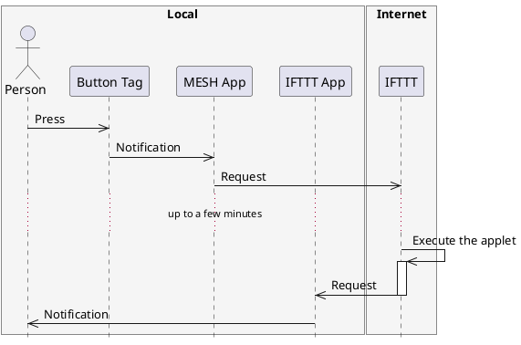

# Getting Started with MESH

## What is MESH?

According to Takehiro Hagiwara, Co-Founder of MESH

> MESH is a toolkit that simplifies inventing and making to free students from the paralysis of technical challenges, and allow for more focus on creativity and discovery.

Video: [MESH : How it works](https://youtu.be/zgGyTU-pucM)

MESH is a tool that let you explore the world of IoT (Internet of things) using everyday objects, consisting of the MESH Tags, the MESH App and the Software Tags.

@import "https://d1snu2um2qo33r.cloudfront.net/en/img/app/about-img.png"

(source: http://meshprj.com/en/app/)

With MESH, you can:
- Connect to various internet services (i.e. Gmail and IFTTT)
- Connect to various wireless devices (i.e. Philips Hue and Olympus Air)
- Control functions on your iPhone, iPad or iPod touch (e.g. camera, speaker, microphone and notification)

## What You Need

- MESH Tags: 1 set
- MESH Design Pattern Cards: 1 set
- iPad: 1

## Turn on Your MESH Tags

The power button is located underneath the icon. If nothing when you press the icon, the power is off. To turn on your MESH Tag, press and hold the icon for two seconds. A white light will appear once your Tag is turned on (if the light does not appear, the MESH Tag has run out of battery). To turn off your MESH Tag, press and hold the icon again for two seconds.

## Pair Your MESH Tags with Your MESH App

1. Launch the MESH App
2. Tap on the `+` icon in the top left to create a new recipe
3. Tap on the recipe to open
4. Tap on `+ Add` in the top right to start paring
5. Bring your MESH Tags near to your device and pair one by one

## Create a Connection

1. Tap on the Button Tag on your MESH App
2. Drag the Tag onto the canvas
3. Tap on the LED Tag, the drag and drop onto the canvas
4. Connect the Tags
5. Press the icon on the (physical) Button Tag and see what happens on the LED Tag

## How to Use the MESH Design Pattern Cards

The MESH Design Pattern Cards is a set of cards to use in the scenes that develop ideas by multiplying problems you found or what you want to
make and what you can do with MESH.

On the surface of each card what you can do with MESH is explained and on the back you can see how it is realized. By arranging multiple cards like Input > Output, Input > Processing > Output, you can organize it even if it looks complicated at first glance. If you come up with usages or implementation methods that are not found on standard cards, please fill out blank cards and share them.

### Downloads

- [Cards](http://support.meshprj.com/hc/ja/article_attachments/115002103234/MESH_design_pattern_cards_English.pdf)
- [Tabs](http://support.meshprj.com/hc/ja/article_attachments/115002100713/MESH_design_pattern_cards_tab_English.pdf)

## Let's Make a Recipe to Make Fun

Reference: [Let's make a cup that talks using MESH](https://youtu.be/56IH6XfRHx4)

1. Think about when and what to do in 2 minutes
2. Make it actually using MESH in 5 minutes
3. Present in turns in 3 minutes

## What is IFTTT?

To connect things to the network, it is easy to use a web service that freely combines and executes various web services as triggers or actions. A representative example of such a web service is "IFTTT" operated by IFTTT Inc., a web service company in the United States.

In addition to various web services including Twitter, Facebook, and Instagram, IFTTT supports devices such as smart lock, network compatible remote control, communication robot and so on. Also, it supports a mechanism for connecting homebrew devices.

## Getting Started with IFTTT

1. Point your web browser to https://ifttt.com/ and create an account
2. Install an application for your iOS or Android device
3. Create a recipe to get familiar with IFTTT terms (e.g. applets, services, triggers, actions and so on)

## Let's Make an Applet to Make Fun

1. Think about when and what to do in 2 minutes
2. Make it actually using MESH and IFTTT in 10 minutes
3. Present in turns in 3 minutes

## What is the GPIO Tag?

> It’s for advanced users.
This gray GPIO (General Purpose Input Output) Tag enables you to enjoy wireless electronic kits and more. It has a digital and analog input/output that connects other sensors or actuators, such as light sensors, motors and written circuit with a conductive pen.

A GPIO Tag has 3 Digital In pins, 3 Digital Out pins, 1 Analog In pin, 1 PWM Out pin, 1 VOut Supply pin and 1 GND pin ([details](http://meshprj.com/support/faq/gpio/)).

A GPIO Tag enables you to combine with an Arduino board by connecting with jumper wires, connect to little Bits and Grove modules via dedicated adapters. Moreover, several dedicated modules such as touch sensor and servo motor are on sale.